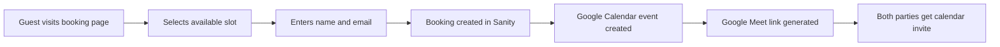
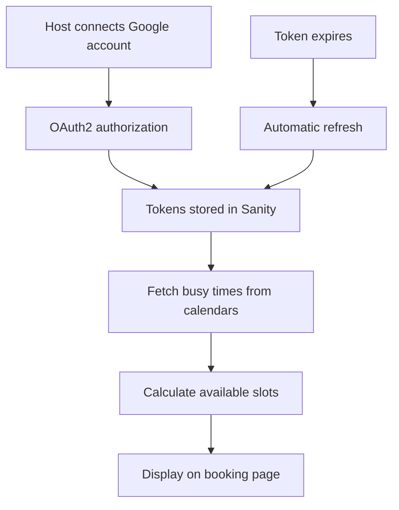
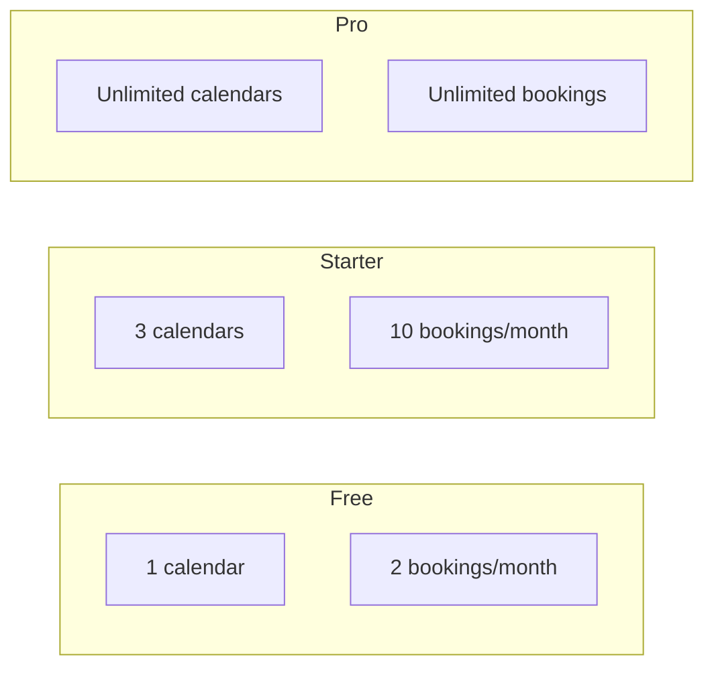

# MeetWise

[](https://nextjs.org/)
[](https://clerk.com/)
[](https://sanity.io/)
[](https://www.typescriptlang.org/)

## Build a Professional Scheduling Platform from Scratch

Learn how to build a full-stack scheduling SaaS application with real-time calendar sync, subscription billing, and a beautiful booking experience.

---

> **Who is this for?**
>
> Developers who want to learn how to build production-ready SaaS applications. Perfect for those learning Next.js, authentication patterns, and working with external APIs like Google Calendar.

> **What problem does it solve?**
>
> Eliminates the endless "what time works for you?" email chains. Hosts share their booking link, guests pick an available time, and everyone gets a calendar invite with a video call link automatically.

> **Technical Highlights**
>
> - Next.js 16 App Router with React 19
> - Clerk authentication with built-in subscription billing
> - Sanity CMS for real-time data management
> - Google Calendar OAuth2 with automatic token refresh
> - Tiered pricing (Free / Starter / Pro)

---

## 👇🏼 Set Up Your Accounts First

Before cloning this repo, create accounts with these services:

| Service | Purpose | Link |
|---------|---------|------|
| **Clerk** | Authentication & Subscription Billing | [Sign up for Clerk](https://go.clerk.com/hIH1icu) |
| **Google Cloud** | Calendar API for syncing events | [Google Cloud Console](https://console.cloud.google.com/) |
| **Vercel** | Deployment (optional for local dev) | [Vercel](https://vercel.com/) |

---

## 📅 What Is This App?

**Think of MeetWise as your personal scheduling assistant** — but one that never sleeps and never double-books you.

Here's how it works in plain English:

### For Hosts (You)
1. **Set your availability** — Use a visual calendar to drag and create time blocks when you're free for meetings
2. **Connect your Google Calendar** — MeetWise reads your existing events so it never shows a time when you're already busy
3. **Create meeting types** — Define different kinds of meetings (15-min quick chat, 30-min consultation, 60-min deep dive)
4. **Share your booking link** — Send `yoursite.com/book/your-name` to anyone who wants to meet

### For Guests (People booking with you)
1. Visit your public booking page
2. See only the times you're actually available
3. Pick a slot and enter their name + email
4. Get a Google Calendar invite with a Google Meet link automatically

### Perfect For
- **Freelancers** scheduling client calls
- **Consultants** managing discovery sessions
- **Coaches & Tutors** booking 1-on-1 sessions
- **Developers** learning to build SaaS products

---

## ✨ Features

### For End Users

| Feature | Description |
|---------|-------------|
| 📅 **Smart Availability** | Drag-and-drop calendar to set when you're free for meetings |
| 🔄 **Google Calendar Sync** | Connect multiple Google accounts to prevent double-booking |
| 🎥 **Automatic Google Meet** | Every booking generates a video call link automatically |
| ⏱️ **Flexible Meeting Types** | Create 15, 30, 45, 60, or 90-minute meeting options |
| 🌍 **Timezone Intelligence** | Guests see availability in their local timezone |
| ✅ **Real-time Status** | Track who accepted, declined, or hasn't responded |
| 🔗 **Shareable Booking Pages** | Clean URLs like `/book/your-name/consultation` |

### Technical Features (The Smart Stuff)

| Feature | Description |
|---------|-------------|
| ⚡ **Next.js 16 App Router** | Latest React 19 with Server Components |
| 🔐 **Clerk Auth + Billing** | Authentication and subscription management in one |
| 📊 **Sanity CMS** | Real-time data with embedded Studio at `/studio` |
| 🔑 **OAuth2 Token Refresh** | Automatic handling of expired Google tokens |
| 💰 **Tiered Pricing** | Free, Starter ($X/mo), and Pro ($X/mo) plans |
| 📈 **Admin Dashboard** | Insights and feedback management |
| 🎨 **Shadcn UI** | Beautiful, accessible components |

### Pricing Tiers

| Feature | Free | Starter | Pro |
|---------|------|---------|-----|
| Connected Calendars | 1 | 3 | Unlimited |
| Bookings per Month | 2 | 10 | Unlimited |
| Availability Management | ✅ | ✅ | ✅ |
| Google Calendar Sync | ✅ | ✅ | ✅ |
| Custom Booking Page | ✅ | ✅ | ✅ |

---

## 🔄 How It Works

### User Booking Flow



### Google Calendar Sync Architecture



### Subscription Tier System



---

## 🚀 Getting Started

### Prerequisites

Before you begin, make sure you have:

- **Node.js 18.17+** — [Download](https://nodejs.org/)
- **pnpm** — Install with `npm install -g pnpm`
- **Clerk account** — [Sign up](https://go.clerk.com/hIH1icu)
- **Sanity account** — [Sign up](https://www.sanity.io/sonny?utm_source=youtube&utm_medium=video&utm_content=scheduling-platform)
- **Google Cloud project** — With Calendar API enabled

### Step-by-Step Setup

#### 1. Clone the Repository

```bash
git clone <your-repo-url>
cd MeetWise
```

#### 2. Install Dependencies

```bash
pnpm install
```

#### 3. Set Up Environment Variables

```bash
cp .env.example .env.local
```

Then fill in your values (see [Environment Variables](#-environment-variables) section below).

#### 4. Configure Clerk

1. Go to your [Clerk Dashboard](https://dashboard.clerk.com/)
2. Create a new application
3. Copy your **Publishable Key** and **Secret Key**
4. Set up billing products for Starter and Pro tiers (optional)

#### 5. Configure Sanity

1. Go to [sanity.io/manage](https://www.sanity.io/manage)
2. Create a new project
3. Copy your **Project ID**
4. Create a dataset (e.g., `production`)
5. Generate an API token with **Editor** permissions

#### 6. Configure Google Calendar API

1. Go to [Google Cloud Console](https://console.cloud.google.com/)
2. Create a new project
3. Enable the **Google Calendar API**
4. Create OAuth 2.0 credentials (Web application)
5. Add authorized redirect URI: `http://localhost:3000/api/calendar/callback`
6. Copy your **Client ID** and **Client Secret**

#### 7. Start the Development Server

```bash
pnpm dev
```

Open [http://localhost:3000](http://localhost:3000) to see your app!

#### 8. Access Sanity Studio

Visit [http://localhost:3000/studio](http://localhost:3000/studio) to manage your content.

---

## 🔐 Environment Variables

Create a `.env.local` file in your project root with these variables:

```bash
# ===========================================
# CLERK - Authentication & Billing
# ===========================================
NEXT_PUBLIC_CLERK_PUBLISHABLE_KEY=pk_test_...
CLERK_SECRET_KEY=sk_test_...

# ===========================================
# SANITY - Content Management
# ===========================================
NEXT_PUBLIC_SANITY_PROJECT_ID=your-project-id
NEXT_PUBLIC_SANITY_DATASET=production
NEXT_PUBLIC_SANITY_API_VERSION=2026-01-07
SANITY_API_TOKEN=sk...

# ===========================================
# GOOGLE - Calendar API
# ===========================================
GOOGLE_CLIENT_ID=your-client-id.apps.googleusercontent.com
GOOGLE_CLIENT_SECRET=GOCSPX-...
GOOGLE_REDIRECT_URI=http://localhost:3000/api/calendar/callback
```

### Security Notes

> ⚠️ **Important Security Rules**
>
> - **NEVER commit `.env.local`** to version control
> - Variables starting with `NEXT_PUBLIC_` are exposed to the browser — only use for non-sensitive values
> - Keep `CLERK_SECRET_KEY`, `SANITY_API_TOKEN`, and Google credentials server-side only
> - For production, update `GOOGLE_REDIRECT_URI` to your production URL

---

## 🗃️ Database Schema Overview

MeetWise uses Sanity CMS with the following document types:

### User
The main user document linked to Clerk authentication.

| Field | Type | Description |
|-------|------|-------------|
| `clerkId` | string | Unique Clerk user ID |
| `name` | string | User's display name |
| `email` | string | User's email address |
| `slug` | slug | URL-friendly identifier for booking page |
| `availability` | array | Time blocks when user is available |
| `connectedAccounts` | array | Google Calendar OAuth connections |

### MeetingType
Templates for different kinds of meetings.

| Field | Type | Description |
|-------|------|-------------|
| `name` | string | e.g., "Quick Chat", "Consultation" |
| `slug` | slug | URL identifier |
| `duration` | number | 15, 30, 45, 60, or 90 minutes |
| `description` | text | Shown on booking page |
| `host` | reference | Link to User document |
| `isDefault` | boolean | Default meeting type for booking page |

### Booking
Individual scheduled meetings.

| Field | Type | Description |
|-------|------|-------------|
| `host` | reference | The user being booked |
| `meetingType` | reference | Type of meeting booked |
| `guestName` | string | Name of the person booking |
| `guestEmail` | string | Email of the person booking |
| `startTime` | datetime | When the meeting starts |
| `endTime` | datetime | When the meeting ends |
| `googleEventId` | string | ID in Google Calendar |
| `meetLink` | url | Google Meet video link |
| `notes` | text | Additional notes from guest |

### ConnectedAccount (Embedded in User)
OAuth tokens for Google Calendar integration.

| Field | Type | Description |
|-------|------|-------------|
| `accountId` | string | Google user ID |
| `email` | string | Google account email |
| `accessToken` | string | OAuth access token (hidden) |
| `refreshToken` | string | OAuth refresh token (hidden) |
| `expiryDate` | number | Token expiration timestamp |
| `isDefault` | boolean | Use for creating new events |

### Feedback
User-submitted feedback for admins.

| Field | Type | Description |
|-------|------|-------------|
| `user` | reference | Who submitted the feedback |
| `content` | text | Feedback content |
| `createdAt` | datetime | When submitted |
| `archived` | boolean | Hidden from dashboard |

---

## 🚢 Deployment

### Deploy to Vercel

#### Option 1: Vercel CLI

```bash
# Install Vercel CLI
pnpm add -g vercel

# Deploy
vercel
```

#### Option 2: GitHub Integration

1. Push your code to GitHub
2. Go to [vercel.com/new](https://vercel.com/new)
3. Import your repository
4. Add all environment variables
5. Deploy!

### Post-Deployment Checklist

After deploying, make sure to:

- [ ] Update `GOOGLE_REDIRECT_URI` to `https://your-domain.com/api/calendar/callback`
- [ ] Add your production URL to Google OAuth authorized redirect URIs
- [ ] Add your production URL to Google OAuth authorized JavaScript origins
- [ ] Test the complete booking flow end-to-end
- [ ] Verify Clerk webhooks are configured (if using)
- [ ] Set up Clerk billing products with production pricing

---

## 🔧 Common Issues & Solutions

### Authentication Issues

**Problem:** Redirect loop after signing in
```
Solution: Check that your Clerk middleware is configured correctly 
and your publishable key matches your environment.
```

**Problem:** "Unauthorized" errors on protected routes
```
Solution: Ensure clerkMiddleware() is running and the route 
isn't accidentally excluded in the matcher config.
```

### Google Calendar Issues

**Problem:** OAuth error "redirect_uri_mismatch"
```
Solution: The redirect URI in Google Cloud Console must 
EXACTLY match GOOGLE_REDIRECT_URI in your .env.local
(including http vs https and trailing slashes).
```

**Problem:** "Token has been expired or revoked"
```
Solution: The automatic token refresh may have failed. 
Ask the user to disconnect and reconnect their Google account.
```

**Problem:** Calendar events not showing busy times
```
Solution: Ensure the Google account has calendar events 
with "Busy" status (not "Free"). All-day events are 
intentionally skipped.
```

### Sanity Issues

**Problem:** "Warning: SANITY_API_TOKEN is not set"
```
Solution: Add a valid Sanity API token with Editor 
permissions to your .env.local file.
```

**Problem:** CORS errors when fetching from Sanity
```
Solution: Add your domain to CORS origins in Sanity 
project settings (sanity.io/manage).
```

### Development Issues

**Problem:** Port 3000 already in use
```bash
# Find and kill the process
lsof -i :3000
kill -9 <PID>

# Or use a different port
pnpm dev -- -p 3001
```

**Problem:** TypeScript errors after schema changes
```bash
# Regenerate types
pnpm typegen
```

---


### You CAN:
- ✅ Use this code for **personal learning**
- ✅ **Modify** and build upon this project
- ✅ **Share** your modifications with proper attribution
- ✅ Use as a **portfolio piece** to showcase your skills


---

## 📚 Quick Reference

### Useful Commands

```bash
# Development
pnpm dev              # Start dev server
pnpm build            # Build for production
pnpm start            # Run production build

# Code Quality
pnpm lint             # Run Biome linter
pnpm format           # Format code with Biome
pnpm typecheck        # Check TypeScript types

# Sanity
pnpm typegen          # Generate TypeScript types from Sanity schema
```

### Key Files & Folders

```
├── app/
│   ├── (app)/              # Protected app routes (dashboard)
│   ├── (admin)/            # Admin dashboard
│   ├── book/[slug]/        # Public booking pages
│   ├── api/calendar/       # Google Calendar OAuth routes
│   ├── studio/             # Embedded Sanity Studio
│   └── pricing/            # Pricing page with Clerk Billing
├── components/
│   ├── booking/            # Booking calendar & forms
│   ├── calendar/           # Availability calendar components
│   └── ui/                 # Shadcn UI components
├── lib/
│   ├── actions/            # Server Actions
│   ├── features.ts         # Pricing tier limits
│   └── google-calendar.ts  # Google Calendar OAuth helpers
├── sanity/
│   ├── schemaTypes/        # Sanity document schemas
│   ├── queries/            # GROQ queries
│   └── lib/                # Sanity client configuration
└── middleware.ts           # Clerk authentication middleware
```

### Important Concepts

| Concept | What It Does | Where It's Used |
|---------|--------------|-----------------|
| **Server Actions** | Server-side functions callable from client | `lib/actions/` |
| **Clerk `auth()`** | Get current user on server | Protected routes, server actions |
| **Sanity App SDK** | Real-time data fetching | Components using `useDocuments` |
| **OAuth2 Flow** | Connect Google accounts | `/api/calendar/connect` → `/api/calendar/callback` |
| **GROQ Queries** | Query Sanity data | `sanity/queries/` |

---

## 🙏 Acknowledgments

Built with love by [Shakeb Shamsi](https://www.shakeb.onrender.com)


---

**Happy coding! 🚀**

If you found this helpful, consider:
- ⭐ Starring this repository
- 🐦 Sharing on social media
  
